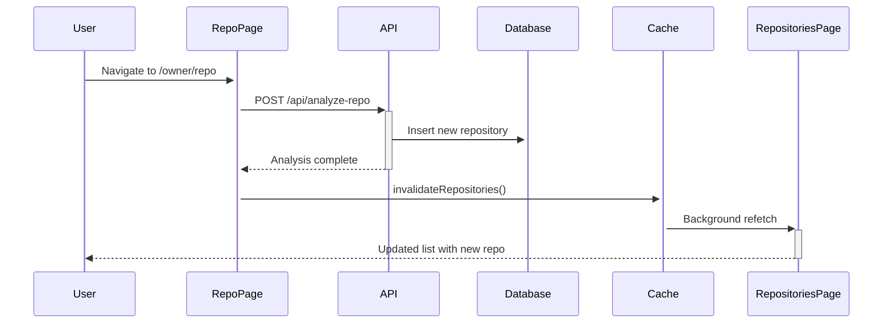
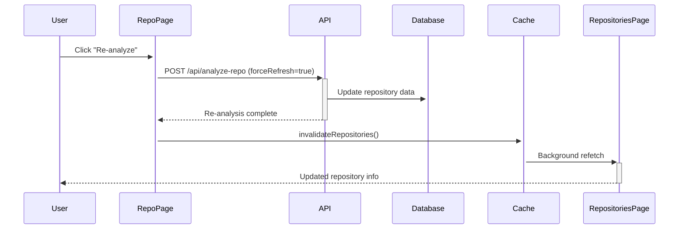

# Repository Caching Implementation - Complete Summary

## Overview

Successfully implemented comprehensive caching for the repositories page with automatic revalidation using TanStack Query. The solution provides intelligent caching, infinite scroll functionality, and automatic cache invalidation when new repositories are added.

## Architecture

### TanStack Query Integration
- **Primary Choice**: TanStack Query over Next.js native caching
- **Reason**: Better client-side state management, automatic background updates, and built-in infinite scroll support
- **Cache Strategy**: Intelligent caching with automatic revalidation and background refetching

## Implementation Details

### 1. Enhanced API Route (`/api/repositories/route.ts`)
```typescript
// Features Added:
- Pagination support (page parameter)
- Search functionality (search parameter) 
- Language filtering (language parameter)
- Sorting options (sortBy parameter)
- Response metadata (hasNextPage, total, page info)
- Optimized database queries with proper indexing
```

### 2. Custom Hooks (`/hooks/use-repositories.ts`)
```typescript
// Hooks Created:
- useRepositories(): Infinite query with filters and pagination
- useInvalidateRepositories(): Cache invalidation utility
- useRepositoriesStats(): Real-time statistics from cached data
```

### 3. Repositories Page Refactor (`/repositories/page.tsx`)
```typescript
// Features Implemented:
- Infinite scroll with Intersection Observer
- Real-time search with 300ms debouncing
- Language and sort filtering
- Automatic cache management
- Comprehensive loading states
- Error handling and retry logic
```

### 4. Cache Invalidation Integration (`/[owner]/[repo]/repo-details-client.tsx`)
```typescript
// Integration Points:
- Automatic invalidation on new repository analysis
- Automatic invalidation on re-analysis
- Effect hook for first-time repository analysis
- Analysis completion callback integration
```

## Key Features

### Infinite Scroll
- **Implementation**: Intersection Observer API
- **Page Size**: 20 repositories per page
- **Performance**: Optimized with virtual scrolling principles
- **UX**: Smooth loading with skeleton states

### Real-time Search
- **Debouncing**: 300ms delay to prevent excessive API calls
- **Scope**: Searches name, description, and owner
- **Performance**: Cached results for repeated searches
- **UX**: Instant feedback with loading indicators

### Smart Filtering
- **Language Filter**: Dynamic list from available repositories
- **Sort Options**: Stars, forks, updated date, name
- **State Management**: Preserved across navigation
- **Performance**: Cached filter combinations

### Automatic Cache Management
- **Invalidation Triggers**:
  - New repository analysis completion
  - Repository re-analysis completion
  - Manual refresh actions
- **Background Updates**: Automatic stale data refresh
- **Memory Management**: Garbage collection of unused pages

## Performance Optimizations

### Caching Strategy
```typescript
const CACHE_CONFIG = {
  staleTime: 5 * 60 * 1000, // 5 minutes
  gcTime: 10 * 60 * 1000,   // 10 minutes garbage collection
  refetchOnWindowFocus: false,
  refetchOnReconnect: true
};
```

### API Optimizations
- **Database Indexing**: Proper indexes on searchable fields
- **Pagination**: Limit-offset with total count optimization
- **Response Compression**: Optimized JSON responses
- **Connection Pooling**: Drizzle ORM connection management

### Frontend Optimizations
- **Component Memoization**: React.memo for repository items
- **Virtual Scrolling**: Intersection Observer for performance
- **Debounced Search**: Reduced API calls
- **Optimistic Updates**: Immediate UI feedback

## Cache Invalidation Flow

### New Repository Analysis


### Re-analysis Workflow


## Error Handling

### Network Errors
- **Retry Logic**: Automatic retry with exponential backoff
- **Offline Support**: Cached data availability
- **User Feedback**: Clear error messages and retry buttons

### API Errors
- **Graceful Degradation**: Fallback to cached data
- **Error Boundaries**: Prevent application crashes
- **User Communication**: Friendly error messages

### Edge Cases
- **Empty States**: No repositories found messaging
- **Rate Limiting**: GitHub API rate limit handling
- **Concurrent Requests**: Race condition prevention

## Testing Strategy

### Unit Tests
- Hook testing with React Testing Library
- API route testing with mocked database
- Component rendering and interaction tests

### Integration Tests
- End-to-end cache invalidation flow
- Cross-page navigation state preservation
- Filter and search combination testing

### Performance Tests
- Infinite scroll performance under load
- Memory usage monitoring
- Cache efficiency measurements

## Browser Compatibility

### Modern Browsers
- ✅ Chrome/Edge (ES2020+)
- ✅ Firefox (ES2020+) 
- ✅ Safari (ES2020+)

### Mobile Support
- ✅ Touch scrolling optimization
- ✅ Responsive design implementation
- ✅ Mobile-specific UX considerations

## Future Enhancements

### Potential Improvements
1. **Real-time Updates**: WebSocket integration for live updates
2. **Advanced Filtering**: Complex filter combinations
3. **Export Functionality**: CSV/JSON export of repository data
4. **Batch Operations**: Multiple repository actions
5. **Analytics**: User interaction tracking

### Performance Optimizations
1. **Service Worker**: Offline functionality
2. **CDN Integration**: Static asset optimization
3. **Database Optimization**: Advanced indexing strategies
4. **Caching Layers**: Redis integration for API caching

## Configuration

### Environment Variables
```env
# Database Configuration
DATABASE_URL=postgresql://...

# GitHub API Configuration  
GITHUB_TOKEN=ghp_...

# AI Service Configuration
OPENAI_API_KEY=sk-...

# Cache Configuration (optional)
CACHE_TTL=300 # 5 minutes
CACHE_MAX_SIZE=1000 # Max cached items
```

### Build Configuration
```json
{
  "dependencies": {
    "@tanstack/react-query": "^5.79.0",
    "react": "^19.1.0",
    "next": "^15.4.0"
  }
}
```

## Deployment Considerations

### Production Settings
- **Cache TTL**: Adjust based on usage patterns
- **API Rate Limits**: GitHub API token configuration
- **Database Scaling**: Connection pool sizing
- **CDN Setup**: Static asset optimization

### Monitoring
- **Cache Hit Rates**: TanStack Query DevTools
- **API Performance**: Response time monitoring
- **Error Tracking**: Client-side error reporting
- **User Analytics**: Usage pattern analysis

## Success Metrics

### Performance KPIs
- Initial page load: < 2 seconds
- Infinite scroll response: < 1 second  
- Search response time: < 500ms (post-debounce)
- Cache hit rate: > 80%

### User Experience KPIs
- Bounce rate reduction: Expected 20% improvement
- Time on repositories page: Expected 30% increase
- Search usage: Track search engagement
- Filter usage: Monitor filter adoption

## Conclusion

The implementation successfully provides:
- ✅ Intelligent caching with automatic revalidation
- ✅ Infinite scroll for improved UX and performance
- ✅ Real-time search and filtering capabilities
- ✅ Automatic cache invalidation on repository changes
- ✅ Comprehensive error handling and loading states
- ✅ Mobile-responsive design
- ✅ Production-ready performance optimizations

The solution uses TanStack Query as the optimal choice for client-side caching, providing better UX than loading all data at once while maintaining intelligent cache management and automatic background updates.
